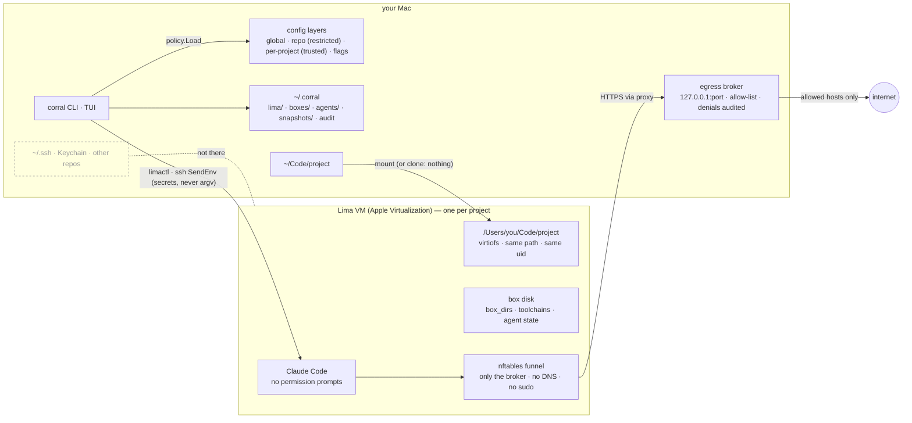
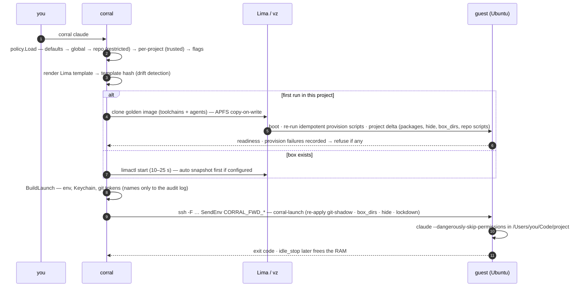

# 🐎 Corral

**Your agent, unleashed. Your Mac, untouched.**

Run AI coding agents at full speed inside a persistent, per-project VM.

Corral is built on [Lima](https://lima-vm.io) and Apple's Virtualization
framework, after a real supply-chain incident involving AI tooling. Each
project gets its own Linux VM; the project directory is mounted at its real
path, the agent gets `sudo` and no permission prompts — and your home
directory, SSH keys, Keychain and other repositories are simply not there.
Outbound traffic can be allow-listed on the Mac, and credentials can stay on
the Mac entirely (`api_brokers`). **macOS 13.5+ today; Linux and Windows are on
the roadmap via Lima's qemu/WSL2 drivers.**

```
cd ~/Code/my-project
corral claude
```

That is the whole workflow. The first box on a Mac builds a **golden image**
(Ubuntu + toolchains + agents, 2–4 minutes, once per toolchain set); every
further project is a copy-on-write clone of it and is ready in about 15
seconds. A stopped box resumes in 10–25 seconds. `corral golden` lists the
images; `--no-golden` builds a box from scratch.

> How does it compare to Docker Sandboxes, matchlock, Bromure or
> katspaugh/machine? See [Corral vs the alternatives](#corral-vs-the-alternatives)
> and the build-vs-buy analysis in [`docs/FEASIBILITY.md`](docs/FEASIBILITY.md).

## At a glance

Measured by testers on real repositories during private development (same task, interleaved runs; the container column is Yolobox/Docker, the setup Corral replaced):

| | **Corral** | Yolobox / Docker |
|---|---|---|
| Overhead per agent invocation (40 s review task) | **1.4 s** | 6.4 s |
| Warm trivial command | **0.46 s** | 5.2 s |
| Second project on the machine | **18 s, +32 MB** | image reuse |
| Disk footprint | **~6 GB** | 38.5 GB of images |
| `flutter build apk` (Android, arm64 box) | **308 s** | 572 s (Docker/amd64) |
| Isolation | **a VM per project**; escape lands in an empty Ubuntu | a container in Docker's shared VM, which sees `/Users` |
| Outbound traffic | **allow-list decided on the Mac**, DNS closed, denials audited | unrestricted |



## What you get

| | |
|---|---|
| **A real boundary** | Dedicated VM per project; the agent has `sudo` and no prompts *inside*; your home directory, keys and Keychain are not there. [Security model →](docs/SECURITY.md) |
| **Egress control** | `network = "broker"`: only the hosts you list, decided on the Mac, DNS closed in the guest, every denial named. `offline` for review sessions. [→](#network-modes--where-the-box-may-connect) |
| **Untrusted repositories** | A repo's `.corral.toml` can shape the guest, never widen host access; `source = "clone"` mounts nothing at all. [→](#source-modes--how-the-code-reaches-the-box) |
| **Speed** | Golden images: the second project is ready in ~15 s; `box_dirs` keeps `node_modules` on the box disk (29× faster installs); 1.4 s overhead per invocation. |
| **Your login, your rules** | `agent_state = shared \| seeded \| isolated`; tokens from the environment or the macOS Keychain (`keychain_env`), forwarded over SSH, never on a command line. [→](#agent-state--where-the-login-lives) |
| **Toolchains** | node · go · python · docker · java · android (aapt2 under Rosetta) · flutter — pinned and checksum-verified. [→](#toolchains) |
| **Undo** | APFS-clone snapshots at every session start; `corral undo`. [→](#snapshots-and-undo) |
| **Visibility** | Dashboard with guest *and host* memory, a log pane (`l`), drift detection, `doctor <box>` preflight, names-only audit log; `list --json` is read-only and carries live metrics. |
| **Unattended** | A Mac mini running a queue: `env_file` credentials without a login session, admission control (`max_running`, `memory_reserve`), `run --timeout`, distinguishable exit codes (78/75/69/124) and `--result` JSON, `api_brokers` so tokens never enter the box. [→](#unattended-host--a-mac-mini-running-a-queue) |
| **Verifiable releases** | `SHA256SUMS` signed with minisign on every tag; public key in [`release/minisign.pub`](release/minisign.pub). [→](#ci-gates-and-releases) |
| **Discoverable** | [`docs/FEATURES.md`](docs/FEATURES.md) — every command, key, mode and control on one line each; `corral docs` prints it; `llms.txt` for your AI assistant. |

---

## Install

Requirements: macOS 13.5 or newer (Apple Silicon or Intel) and
[Homebrew](https://brew.sh).

**Homebrew (recommended):**

```bash
brew tap corral-sh/tap
brew trust corral-sh/tap      # Homebrew ≥ 6 requires third-party taps to be trusted explicitly
brew install corral-sh/tap/corral
```

This pulls Lima as a dependency and builds `corral` from the tagged source —
there is no opaque binary download. Upgrade with `brew upgrade corral-sh/tap/corral`.
The fully qualified name matters: homebrew-core's `corral` is an unrelated
Pony-language tool, and Homebrew resolves the bare name to core.

**From a checkout** (if you want to read or hack on it first):

```bash
git clone https://github.com/corral-sh/corral.git
corral/install.sh      # installs Lima/Go via brew if missing, builds, installs
```

Then:

```bash
corral setup       # 1 minute: prerequisites + defaults (CPUs, RAM, toolchains…)
cd ~/Code/<project>
corral claude      # builds the box, starts Claude Code inside it
```

Log in once with `/login` inside Claude; the session is stored in
`~/.corral/agents/claude` and reused by every box (`agent_state = "shared"`). Or export
`ANTHROPIC_API_KEY` / `CLAUDE_CODE_OAUTH_TOKEN` on your Mac and it is forwarded.

Upgrading later: `corral upgrade` (runs `brew upgrade` or, for a checkout
install, pulls and rebuilds). A release that changes the Lima template (mounts,
provisioning, resources — the changelog says so) leaves existing boxes showing
*config changed* in `corral list`; run `corral rebuild` once per box to
pick it up.

## Everyday commands

| Command | What it does |
|---|---|
| `corral claude [-- args]` | Start Claude Code in this project's box (`--ask` keeps Claude's permission prompts) |
| `corral shell` | Interactive shell in the box |
| `corral run <cmd>` | One command in the box, e.g. `corral run make test` |
| `corral` | **Dashboard**: every box, status, live CPU/RAM/disk; `enter` launches, `h` shell, `s` start/stop, `l` log pane, `x` delete |
| `corral list [--json]` / `info` / `logs` | Status table (read-only; `--json` adds live guest metrics per running box) · details of one box · boot/provisioning log |
| `corral gc` | Stop boxes idle longer than their `idle_stop` (also runs on launch and in the dashboard — never from `list`) |
| `corral agents import claude` | Copy your `~/.claude` commands, skills, agents, settings and `CLAUDE.md` (never credentials) into the agent's box state — every box sees them |
| `--yes` / `--no-create` | First run in a project asks before building its box (a wrong directory is a 3 GB accident); `--yes` skips the question, `--no-create` refuses instead. Non-interactive runs (`CORRAL_PLAIN=1`, no TTY) never ask |
| `corral stop [--all]` | Free the RAM; next start ≈ 20 s |
| `corral rebuild` | Apply config changes (resources, toolchains, mounts) |
| `corral code` | Open the project *inside the box* in VS Code (`--editor cursor` / `jetbrains`) over SSH |
| `corral egress` | Network mode, allowed destinations and recent denials (`network = "broker"`) |
| `corral snapshot create <tag>` | Snapshot the box disk (APFS clone, instant); `restore` rolls back |
| `corral undo` | Roll back to the snapshot taken at the last session start (`snapshot = "auto"`) |
| `corral audit` | Who launched what, where, with which variables |
| `corral doctor [box]` | Check the host; **with a box**: preflight from inside it — agent, toolchains, controls active, every `git_tokens` host and `egress` entry reachable, granted variables set, provision scripts OK (`--json`; `run --preflight` gates a session on it) |
| `corral delete` | Remove the VM; project and login are kept |

Every command accepts `-C <dir>` to act on another project and `--box <name>`
to pick a box explicitly. Tab completion: `corral completion zsh`.

## Configuration

Three TOML files; **flags › host per-project › project › global › defaults**.
Lists (packages, env, mounts…) are unioned so a project adds to the global set.

`~/.corral/config.toml` — written by `corral setup`:

```toml
default_agent = "claude"
cpus = 4
memory = "4GiB"                    # measured default; "6GiB" with docker or big Go builds
disk = "60GiB"                     # sparse — only used space costs anything
toolchains = ["node"]              # node | go | python | docker | java | android | flutter; [] = none (drops the default node)
yolo = true                        # skip the agent's own permission prompts
stop_on_exit = false
idle_stop = "30m"                  # stop a box with no session for 30m ("off" to keep RAM held)
snapshot = "auto"                  # clone the box disk at each session start; `corral undo` rolls back
snapshots_keep = 3
git_identity = true                # forward user.name / user.email only
git_tokens = { "git.example.com" = "GITLAB_TOKEN" }   # HTTPS pushes from the box (user oauth2)
# narrower: a deploy token, with its own username — the variable may come from keychain_env
# git_tokens = { "git.example.com" = { token = "GITLAB_DEPLOY_TOKEN", user = "gitlab+deploy-token-1" } }
```

`<project>/.corral.toml` — commit it so the team shares one box definition
(`corral config init` writes a commented template):

```toml
toolchains = ["node", "go", "docker"]
rosetta = true                                       # amd64 binaries / containers in the arm64 box
packages = ["default-mysql-client", "protobuf-compiler"]
env = ["APP_ENV=dev"]                                # literal values only
provision = ["scripts/box-setup.sh"]                 # runs once at box creation
hide = [".env", "secrets/"]                          # shown empty inside the box
box_dirs = ["node_modules", "build"]                 # on the box disk: 29× faster installs, empty on the Mac
network = "offline"                                  # no egress; sudo removed
readonly_project = true                              # a project may tighten, never loosen
profile = "strict"                                   # or one named bundle instead of the keys above
```

**Profiles** bundle the security keys so a guarantee is written once and tested once
(`internal/policy/profile.go`, `TestStrictProfileHasNoSudoAndNoEgress`) instead of being
reconstructed from N flags. A profile is a **floor**: keys may tighten beyond it, never loosen below
it, whichever file or flag set them.

| `profile =` | Guarantees |
|---|---|
| `"default"` | outbound internet; each key stands alone |
| `"offline"` | `network = "offline"` — no egress except to the Mac, `sudo` removed |
| `"strict"` | `network = "broker"` + `agent_state = "isolated"`, `ssh_agent = false`, `no_env_passthrough = true`, `protect_git_metadata = true` |

A project may raise the profile, never lower it; `--profile strict` raises it for one launch;
`corral info` prints the effective profile.

`strict` means **no ambient environment**: `forward_env` and the agent's own credential variables
(`CLAUDE_CODE_OAUTH_TOKEN`, `ANTHROPIC_API_KEY`) are *not* forwarded even when the host has them —
`corral config` marks `forward_env` as suppressed and the launcher warns per dropped variable.
The explicit paths still work under `strict` and are the intended ones: `keychain_env`,
`env_from_host`, `env`, `env_file`, or `api_brokers` so the token never enters the box at all.

## Snapshots and undo

`corral snapshot create <tag>` clones the box's VM disk (`disk` + NVRAM) with an APFS
copy-on-write clone — instant, and it only costs the blocks that later diverge. `snapshot = "auto"`
takes one at every session start **when the box is stopped** (the normal case with `idle_stop`; a
running box is skipped with a note, because stopping it would cost a boot) and keeps the last
`snapshots_keep`; `corral undo [box]` stops the box and restores the newest (`--tag` for a
manual one, `--start` to boot afterwards). Plainly: with `source = "mount"` the **project directory is
not in the snapshot** — it lives on your Mac; use git. With `source = "clone"` the repository is on
the VM disk and is rolled back too. Lima's own `limactl snapshot` is unimplemented for the vz driver,
which is why these are Corral's.

## Agent state — where the login lives

| `agent_state =` | The box sees | Trade-off |
|---|---|---|
| `"shared"` (default) | `~/.corral/agents/<agent>` mounted read-write | one login for every box; a compromised box can read **or overwrite** the login all the others use |
| `"seeded"` | a read-only copy of that directory, copied onto the box's own disk at first boot | the box starts logged in but later refreshes stay local — an overwrite cannot reach other boxes; the token copy is still readable inside. **One box per seed:** Claude Code's refresh token is single-use (measured) — the first copy to refresh invalidates every other copy *including the host login*, so a second seeded box fails at the first token expiry with "OAuth session expired". Not a default for that reason |
| `"isolated"` | nothing | log in once per box; nothing of your host login enters it |

Tighten-only for a project (`shared → seeded → isolated`); `shared_agent_state = true/false` is the
deprecated alias for `shared`/`isolated`. Read-only mounting the shared directory is not an option:
Claude Code rewrites its credentials on OAuth refresh. Per-box tokens would close the read exposure;
until then `isolated` is the only mode that keeps the host login out entirely.

The token does not have to live in every shell. `keychain_env = ["CLAUDE_CODE_OAUTH_TOKEN"]` in
`~/.corral/config.toml` reads it at launch from the macOS Keychain (a generic password whose
*service* is the variable name — `security add-generic-password -a "$USER" -s CLAUDE_CODE_OAUTH_TOKEN -w '<token>' -U`)
and forwards it over SSH like any other variable; an exported variable wins, a missing item refuses
to start. Trusted layers only — a repository cannot name a Keychain item. macOS asks once per
binary whether `corral` may read the item. A failure names its cause: *no item* (add one), *cannot
be unlocked here* (no GUI session — see `env_file` below) or *exists but this process may not read it*
(add the item with `-A`, or `-T /path/to/corral`; do not add a second item).

On a host with no login session — a Mac mini running a queue under launchd — the login keychain is
locked, so `keychain_env` has nothing to read. `env_file = "~/.corral/env"` (trusted layers only)
names a `KEY=value` file consulted after the exported environment and before the Keychain; it must be
a regular file you own, mode 0600, under your home directory, or the launch refuses. Values never
appear in logs — the audit records `NAME<-env_file`.

A forwarded `CLAUDE_CODE_OAUTH_TOKEN` / `ANTHROPIC_API_KEY` is used directly: a fresh state
directory is seeded with Claude Code's "onboarding done" flag, so the first run does not stop at
*Select login method*. An existing login is never touched.

### Team skills and commands inside the box

The box does not see `~/.claude` — that is the point — so a `/review-mr` command that lives in
`~/.claude/commands` does not exist inside it until you put it there. Two supported ways:

| | How | When |
|---|---|---|
| **Import (copy)** | `corral agents import claude`, or `corral claude --import-config` once | the usual case: `~/.claude/{CLAUDE.md,settings.json,skills,agents,commands}` are copied into the agent's box state (`~/.corral/agents/claude`), which every box mounts. Credentials are never copied. Re-run after you change a command. |
| **Mount (live)** | in `~/.corral/config.toml` or the per-project host file: `mounts = ["~/Code/team-skills/commands:/corral/agents/claude/commands:ro"]` | a shared team repository of skills that should update without re-importing. Read-only, trusted layers only — a repository cannot mount anything. |

A copy is what a policy of *skills over MCPs* wants: nothing inside the box self-updates, and the audit
log shows what was imported and when.

## Network modes — where the box may connect

| `network =` | Egress | Enforced |
|---|---|---|
| `"full"` (default) | outbound internet, like a container | — |
| `"broker"` | **only the hosts in `egress`**, through an allow-list proxy `corral` runs on your Mac (`127.0.0.1:<port>`, loopback only); everything else — DNS included — is rejected in the guest and `sudo` is removed | decision on the Mac (outside the boundary); funnel in the guest (nftables) |
| `"offline"` | nothing except the Mac itself | guest (nftables), `sudo` removed |

A project may tighten `full → broker → offline`, never loosen. `egress` is **trusted-only** — a
repository cannot add hosts; it may ask in its README and you copy them into
`~/.corral/projects/<box>.toml`:

```toml
network = "broker"
egress = ["registry.npmjs.org", "*.golang.org", "proxy.golang.org", "git.example.com:8443"]
```

Defaults are the agents' API and login hosts (`api.anthropic.com`, `*.anthropic.com`,
`platform.claude.com` — the OAuth token refresh); hosts named in
`git_tokens` are added automatically. Entries are exact hosts or `*.suffix` (subdomains only), ports
80/443 unless `:port` is given; IP literals never match. Every tool that honours `HTTP(S)_PROXY`
works (apt, npm, pip, go, git over https, curl, Claude Code); anything that ignores it fails, which is
the control working. SSH-based git is not carried — use `git_tokens` over https. The broker is a
child process started with the box and stopped with it (no daemon); a session refuses to start if it
is not answering. Denied destinations are audited by name: `corral egress` shows them and the fix.
Provisioning (toolchains, packages, project scripts) still runs online on first boot; the lockdown
follows it.

### API access without the token entering the box — `api_brokers`

A reviewer inside a box needs the GitLab API (and often Jira); handing it a personal token is the
broadest credential in the narrowest place. `api_brokers` puts the credential on the Mac instead:

```toml
# ~/.corral/config.toml — trusted layers only; a repository cannot grant a credential
[[api_brokers]]
name     = "gitlab"
upstream = "https://git.example.com"
token    = "GITLAB_TOKEN"          # host variable: exported, env_file, or keychain_env
header   = "PRIVATE-TOKEN"            # auth = "header" (default) · "bearer" · "basic" (+ user = "…")
allow    = [
  "GET  /api/v4/projects/42/**",                       # read the project: MRs, diffs, pipelines
  "POST /api/v4/projects/42/merge_requests/*/notes",   # comment on an MR — nothing else
]

[[api_brokers]]
name = "jira"   upstream = "https://x.atlassian.net"   token = "JIRA_TOKEN"
auth = "basic"  user = "me@example.com"                allow = ["GET /rest/api/3/issue/*"]
```

Inside the box the route is `$CORRAL_API_GITLAB` (`http://192.168.5.2:<port>/gitlab`):

```bash
curl -s "$CORRAL_API_GITLAB/api/v4/projects/42/merge_requests/7/changes"    # 200, via the Mac
curl -s -X DELETE "$CORRAL_API_GITLAB/api/v4/projects/42"                    # 403 api-denied
```

The broker on the Mac matches method + path against `allow` (`*` one segment, `**` the rest), drops
any credential the box sent, adds the real one and forwards over TLS. The token is never in the box's
environment, files or process list; a compromised session can make exactly the listed calls and no
other. Every call is audited — method, path, status, never a body — and `corral egress <box>` shows
the routes, counts and recent denials. Works in `network = "full"` and `"broker"` (the route uses the
same gateway port the firewall already permits); `doctor <box>` probes each route. Not available in
`offline`.

## Source modes — how the code reaches the box

| `source =` | What the box sees | Host sees agent writes | Use it for |
|---|---|---|---|
| `"mount"` (default) | your checkout, live, at its real path (virtiofs) | immediately | everyday work: edit in your editor, agent in the box |
| `"clone"` | **nothing from the Mac.** At session start the box clones the repository (origin + current branch of your checkout, or `--repo URL[@ref]` with no checkout at all) into the same path, using your `git_tokens` credential | only what the agent **pushes** | review/audit sessions, the unattended queue, untrusted repositories — there is nothing a hostile checkout can leave for your Mac to run |

```bash
corral claude --repo git@git.example.com:group/project.git@feature/x   # no checkout needed
cd ~/Code/project && corral claude --dry-run    # with source = "clone" in config: shows what would be cloned
```

### `box_dirs` — install-heavy directories on the box disk

virtiofs is fine for source files and slow for trees with tens of thousands of small files: a
tester measured `yarn install` at **1453 s on the mount vs 50 s on the box disk** (87 435 files),
`npm ci` at 1586 ms vs 556 ms. Instead of giving up mount mode, list those directories:

```toml
box_dirs = ["node_modules", ".dart_tool", "build", ".gradle"]
```

Each one is bind-mounted from the box's own disk (`/corral/local/<dir>`, owned by the box user) over
the project path before every session, so installs and builds run at disk speed and the rest of the
checkout stays live on the Mac. The Mac sees the directory **empty** — run installs in the box, not
on both sides. Contents survive reboots, not `corral rebuild`. Entries are confined to the project
(relative, no `..`, never `.git`); a repository may set this key (it only shapes the guest). Not
applied in clone mode, where everything is on the box disk already.

Clone mode needs `git_tokens = { "<host>" = "<HOST_VAR>" }` for the origin host in your global config
(the box has no SSH keys); the session refuses to start otherwise. A project may set
`source = "clone"` but never `"mount"`. `protect_git_metadata` and `hide` are unnecessary in clone
mode and skipped. `source = "sync"` (copy in, reviewed diff, write back once) is planned.

**Editing in clone mode:** there is no host checkout to edit, so attach an editor to the box:
`corral code` opens the project in VS Code's Remote-SSH (`--editor cursor` likewise;
`--editor jetbrains` prints the Gateway settings). It connects to the ssh alias `lima-<box>`. Lima
regenerates the box's `ssh.config` (and port) on every start, so Corral keeps
`~/.corral/ssh/config` with one `Include` per box and — after asking once, or with `--yes` —
adds a single `Include` of that file to `~/.ssh/config`. Nothing else in `~/.ssh` is touched, and the
same alias works for `ssh lima-<box>` and in mount mode to inspect the guest.

`rosetta = true` turns on Lima's Rosetta 2 integration (Apple Silicon only):
amd64 ELF binaries and `docker run --platform linux/amd64` run near-native
inside the arm64 box, without an emulated x86 VM. Needs a rebuild; `corral
doctor` tells you if Rosetta is not installed on the Mac.

`network = "offline"` (or `--offline`) is for review and audit sessions: once
provisioning has finished, nftables inside the box rejects every outbound
connection except to the Mac (`host.lima.internal`), and the box user's `sudo`
is removed so the agent cannot lift the rule. The box is fully provisioned
first, so toolchains and the agent still install; anything else must be added
via `packages` / `provision` and an `corral rebuild`. A project may set this
but never unset it.

`hide` lists project paths the box must not see: an empty, box-owned file (or
empty directory) is mounted over each one inside the VM, so `.env` reads empty
and anything the agent writes there stays in the box. Relative to the project,
`dir/` for directories; it is hygiene, not a boundary — `sudo` inside the box
can undo it.

By default the box sees a **guest-local copy of `.git/config` and an empty
`.git/hooks`** in place of the host's (`protect_git_metadata = true`): those two
are executed by your Mac at its next git command and appear in no diff, so an
agent's edits to them stay inside the box. Commits, branches and pushes work as
usual; the one visible cost is that commands rewriting the repo config
(`git config --local`, `git remote add`, `git branch -u`) fail inside the box —
make those changes on the host, or `git config --global` for box-local ones.

**The project file is not trusted.** It is written by whoever controls the
repository you are about to sandbox, so it can only shape the guest. Keys that
widen what the box reaches on your Mac — `ssh_agent`, `mounts`, `git_tokens`,
`forward_env`, `env_from_host`, `keychain_env`, `name`, and bare `"KEY"` entries in `env` that
forward a host variable — are refused there and the box does not start; put them
in `~/.corral/config.toml`. `yolo`, `readonly_project`, `agent_state`,
`no_env_passthrough`, `protect_git_metadata` and `network` may only be made stricter by a project, and `cpus` /
`memory` are capped against the host.

`~/.corral/projects/<box>.toml` — **yours**, per project, outside the repo
(`corral config init --host` writes a template). This is where per-project
privilege goes now that the repo file cannot grant it: `ssh_agent = true` for
one project, an extra mount, a token for a second git host. It wins over the
repo file and is keyed by the **effective box name**: `~/.corral/projects/<name>.toml` for a
box named with `--box <name>` (or `name =`), otherwise the file of the name derived from the project
path — so a runner that names its own boxes gets its per-box `readonly_project`, `mounts`, `egress`,
`env_file` like everyone else. `corral config` shows which file applies.

`corral config` prints the resolved result and which files contributed.
Changing anything that shapes the VM marks the box as *drifted* until you
`corral rebuild`.

### Toolchains

| Name | Installs | From |
|---|---|---|
| `node` (default) | Node.js 22 LTS, npm with `min-release-age = 7` | nodejs.org tarball, SHA256 verified |
| `go` | latest stable Go | go.dev tarball, SHA256 verified |
| `python` | Python 3, pip, venv, pipx | Ubuntu apt |
| `docker` | Docker Engine + compose + buildx **inside the box** | Ubuntu apt |
| `java` | OpenJDK 17, `JAVA_HOME` | Ubuntu apt |
| `android` | Android SDK (`platform-tools`, `platforms;android-35`, `build-tools;35.0.0`, licences accepted) + JDK 17; on an arm64 box enables **amd64 multiarch** so `aapt2` runs under Rosetta (needs `rosetta = true`) | cmdline-tools from dl.google.com, SHA256 pinned; components via sdkmanager |
| `flutter` | Flutter stable (3.47.1, or the release in `toolchain_versions`) + Dart, Android artifacts precached; SDK owned by the box user | github.com/flutter/flutter at the release tag, **commit hash pinned and verified** (arm64 Linux has no tarball) |

`toolchains` is unioned across layers, except that an explicit `toolchains = []` means **none** — a
project that does not want Node.js does not get it; an omitted key keeps the default `["node"]`.

A team that pins Flutter (FVM, `.fvmrc`) pins the box the same way — in the repository's own file, since
it only changes what the guest installs:

```toml
toolchains         = ["flutter", "android", "java"]
toolchain_versions = { flutter = "3.44.2" }                      # or "3.44.2@<40-hex commit>" to verify the commit too
```

Each pinned release is its own golden image (the version is part of its identity), so two projects on
different releases never share one. Without `@commit` the tag comes over TLS from github.com and the
provisioning log prints the commit it resolved to, ready to paste in; `doctor <box>` fails the toolchain
check when the installed release is not the pinned one.

Android/Flutter boxes: `memory = "8GiB"` and `rosetta = true`. A tester's `flutter build apk` in the box
took 308 s against 572 s on Docker/amd64; `adb` reaches a device on the Mac via `192.168.5.2`.
Gradle fetches from `dl.google.com`, `maven.google.com`, `repo.maven.apache.org`, `services.gradle.org`
and `storage.googleapis.com` (Flutter) — add them to `egress` in broker mode.

**Alpine / musl builds** (reproducing an Alpine CI image): the box is Ubuntu by design — every
guest control is a systemd unit — so run the same container CI does, inside the box:

```toml
toolchains = ["docker"]
```
```bash
docker run --rm -v "$PWD":/w -w /w alpine:3.20 sh -c 'apk add build-base && make'
```

Anything else: `packages = [...]` (apt) or a `provision` script. The agent can
also `sudo apt install` whatever it needs during a session.

### Provision scripts

`provision = ["scripts/box-setup.sh"]` runs repository scripts at the end of provisioning
(they re-run on every boot, so keep them idempotent). A script runs **as the box user**; add the
line `# corral: system` to run it as root — allowed in `network = "full"` only, because in
offline/broker mode a repository must not be able to pre-empt the in-guest controls. Every script
gets a generated header, so these are always defined:

| Variable | Value |
|---|---|
| `CORRAL_USER` / `CORRAL_HOME` | the box user and their home — they carry your **Mac uid**, so `uid 1000` and `SUDO_USER` are both wrong; `chown "$CORRAL_USER"` what you install |
| `CORRAL_NETWORK` / `CORRAL_SOURCE` | `full` \| `broker` \| `offline`, `mount` \| `clone` |

A script that exits non-zero **fails the start**: `corral` reports
`provision script scripts/box-setup.sh exited 1 — see corral logs <box>` instead of starting a
session in a half-provisioned box. Fix the script and `corral rebuild`.

## Unattended host — a Mac mini running a queue

Corral was built for a person at a keyboard; a queue that starts one box per task (automated MR
review, `@bot` replies, an issue-driven task runner) needs *bounded, machine-readable outcomes*. What
the runner uses, in the order it matters:

```toml
# ~/.corral/config.toml on the runner (trusted layer; a repository can set none of these)
env_file       = "~/.corral/env"   # KEY=value, chmod 0600 — launchd has no login keychain to read
max_running    = 2                    # admission: never start a third box
memory_reserve = "8GiB"               # …and never start one the RAM cannot carry (measured footprints)
timeout        = "45m"                # a hung agent cannot hold a 12 GiB box indefinitely
idle_stop      = "10m"                # stopping is how memory comes back (vz has no balloon)
source         = "clone"              # nothing of the runner is mounted; the box clones the repository
```

```bash
CORRAL_PLAIN=1 corral -C "$checkout" run --preflight --result "$out/result.json" -- claude -p "$prompt"
case $? in
  0)   ;;                       # the agent finished; its output is the result
  78)  echo "config refused";;  # --preflight failed: fix the grant, do not retry
  75)  requeue ;;               # admission refused (max_running / memory); try later
  69)  requeue; alert ;;        # the box died or SSH was lost mid-session
  124) fail "timeout" ;;        # --timeout elapsed; the session and its processes were ended
  *)   fail "agent exit $?" ;;  # the agent's own non-zero status
esac
```

`result.json` carries `outcome`, `exit_code`, `reason`, `duration` and the forwarded variable *names*
— the same record the audit log gets. The full table is in
[`docs/FEATURES.md`](docs/FEATURES.md#exit-codes-and-outcomes).

**After a host reboot** every box is stopped — nothing needs restarting. `run` boots a stopped box on
demand (≈ 25 s), box disks, `box_dirs` and snapshots survive, and `corral gc` / `idle_stop` keep
doing their job. A supervisor may poll `corral list --json` freely: `list` is **read-only** (it
never stops a box — the idle sweep runs on launch, in the dashboard and via `gc`), and for every
running box the JSON carries live `Load`, `MemUsed`/`MemTotal`, `RootUsed`/`RootSize`, `Uptime`
next to `HostMem` (the Mac's real cost); a failed probe fills `MetricsErr` instead of zeros. A box
booting for a session is never idle, however long ago its previous session ended. **Disk**: `corral upgrade` prunes golden images no box references; `doctor` warns
under 20 GiB or 10 % free and names what would free the most. **Credentials**: the audit log
(`~/.corral/logs/sessions.jsonl`, `corral audit`) records launches, refusals, outcomes and
variable names — never values.

Overhead under load, measured by a tester on a 12-core/32 GB Mac with three boxes busy (a Flutter build
plus two Claude reviews): 4.2–4.7 s per `corral run` invocation against 1.4 s idle; load 5.4–7.4,
swap stable, total VM footprint 12.4 GB against 24 GiB of caps. The headline figure is the idle one.

## How it works



Box name = `<dir-slug>-<6 hex of sha256(path)>`; template at `~/.corral/boxes/<box>.lima.yaml`;
secrets ride inside the SSH channel (`SendEnv`/`AcceptEnv`), never on a command line.

Inside the box you are the same user with the same UID as on the Mac, at the
same path, so git, file ownership and editor paths line up. Details in
[`docs/ARCHITECTURE.md`](docs/ARCHITECTURE.md); the threat model in
[`docs/SECURITY.md`](docs/SECURITY.md).

## Corral vs the alternatives

Several good tools now sandbox AI coding agents. What Corral combines — and, as
far as we can tell, no other public tool does all four at once — is:

1. a **persistent, dedicated VM per project** (not a container, not an
   ephemeral sandbox),
2. an **egress allow-list decided on the Mac** (DNS closed in the guest,
   denials audited),
3. **credentials that never enter the sandbox** (`api_brokers` scoped by
   method + path; secrets over SSH `SendEnv`, never argv; names-only audit),
4. **lifecycle management**: golden images, idle stop and GC, admission
   control, snapshots and `undo`, drift detection.

How the closest tools compare (surveyed 2026-08; corrections welcome):

| | Isolation | Per-project persistence | Egress allow-list | Credentials | Lifecycle | Platforms |
|---|---|---|---|---|---|---|
| **Corral** | dedicated Lima VM per project | ✓ | ✓ broker on the Mac, DNS closed, denials audited | stay on the Mac (`api_brokers`); forwarded values only over SSH `SendEnv` | golden images, `idle_stop`/`gc`, admission, snapshots/`undo` | macOS 13.5+ (Apple Silicon & Intel); Linux/Windows planned |
| [Docker Sandboxes](https://docs.docker.com/ai/sandboxes/) | microVM per workspace | ✓ (named per directory; the project is bind-mounted from the host) | ✓ proxy policies (Open/Balanced/Locked-down) | ✓ `sbx secret`, injected on the wire | no snapshots or idle-stop documented | macOS 14+ (AS), Windows 11, Ubuntu; Docker account required |
| [matchlock](https://github.com/jingkaihe/matchlock) | microVM (Firecracker/vz) | ephemeral by default (`--rm=false` to keep) | ✓ `--allow-host` | ✓ placeholder injection by a host proxy | — | Linux, macOS (AS only) |
| [Bromure](https://github.com/rderaison/bromure) | VM per workspace (GUI workbench) | ✓ workspaces persist | ✓ domain + method/path rules, consent TTLs, supply-chain scanning | ✓ token stubbing; SSH keys stay in the Keychain | no idle-stop/GC/snapshots documented | macOS 14+ (AS only) |
| [katspaugh/machine](https://github.com/katspaugh/machine) | Lima VM per project | ✓ | — | partial: SSH agent forwarded, but API keys land in guest tmpfs | `up`/`down`/`bake`; no idle GC or snapshots | macOS 13+ |

Each of these is good at what it aims for — Docker Sandboxes is the closest
overall (its microVM + proxy + secret-injection design validates the model),
Bromure stacks the most security controls at the boundary, matchlock is the
lightest, and katspaugh/machine shares the per-project-Lima-VM architecture.
Corral's bet is that for **daily work on long-lived repositories** the unit
that matters is the project, so the VM, its toolchains, its egress policy and
its lifecycle should all be keyed on the project — in one open-source CLI with
no account and no third-party sandbox image (the guest is a digest-pinned
Ubuntu cloud image plus checksum-verified toolchains; every script is in this
repository).

The earlier container-based generation of sandboxes (e.g.
[Yolobox](https://github.com/finbarr/yolobox)) is assessed in
[`docs/FEASIBILITY.md`](docs/FEASIBILITY.md): a container inside Docker
Desktop's shared VM — which has `/Users` file-shared into it — is a much
weaker boundary than a dedicated VM, and mounting the host Docker socket
into a sandbox undoes it entirely.

Honest trade-off: a VM per project costs boot time and RAM that a container
does not. Corral spends them to buy a real boundary.

## Roadmap

Corral was developed privately through 0.6; **0.7 is the first public
release**. Shipped so far: golden images, `hide`, offline mode, Rosetta,
configuration trust classes, `source = "clone"`, the egress broker and
`profile = "strict"`, `corral code`, snapshots + `undo`, `agent_state`,
`box_dirs`, java/android/flutter toolchains, `keychain_env`, `doctor <box>`,
the unattended-host set (`env_file`, admission control, `run --timeout` /
`--result`, exit codes, read-only `list --json`), `api_brokers`, the dashboard
log pane and signed releases.

Next:

- **additional agents** (Codex, Gemini CLI, OpenCode) via the agent interface;
- **Linux hosts** (Lima/qemu) and **Windows hosts** (Lima/WSL2);
- `source = "sync"` (copy in, reviewed diff, write back once);
- the Apple `container` driver as macOS 26 adoption grows.

Work items are [GitHub issues](https://github.com/corral-sh/corral/issues).

## Development

```bash
make build && bin/corral doctor
make test lint
make docs                                                   # regenerate docs/FEATURES.md after a command/config change
CORRAL_PLAIN=1 bin/corral run -- claude --version   # real VM end-to-end
make e2e                                                    # scripts/e2e.sh: throwaway boxes under a temp CORRAL_HOME,
                                                            # asserts mounts, hide, git shadow, broker, offline, snapshots (~4 min)
```

Repository layout, conventions and the release checklist are in
[`CLAUDE.md`](CLAUDE.md). Changes are tracked per release in [`changelog/`](changelog/) (index: [`CHANGELOG.md`](CHANGELOG.md));
releases are annotated `vX.Y.Z` tags on `main`.

## CI gates and releases

Every push and pull request runs the `verify` jobs in parallel on GitHub
Actions ([`.github/workflows/ci.yml`](.github/workflows/ci.yml)); every one of
them must be green before anything is built or released:

| Job | Gate |
|---|---|
| `test` | `gofmt`, `go vet`, `go mod verify` (go.sum integrity), `go test -race` |
| `vulncheck` | **govulncheck** against the Go vulnerability DB (stdlib + dependencies, call-graph aware) |
| `lint` | **golangci-lint** with `gosec`, `errorlint`, `noctx`, … (`.golangci.yml`) |
| `shellcheck` | `install.sh` and every guest script |
| `gitleaks` | secrets anywhere in the full git history |
| `build` | cross-compile darwin arm64/amd64 + `SHA256SUMS` (the only check that macOS-only files compile — CI runners are Linux) |

On `vX.Y.Z` tags, [`.github/workflows/release.yml`](.github/workflows/release.yml)
re-runs the gates, builds, **signs `SHA256SUMS` with minisign**
(`SHA256SUMS.minisig`; the secret key lives only in the `CORRAL_MINISIGN_KEY`
Actions secret, the public key is [`release/minisign.pub`](release/minisign.pub)
and is printed in every release's notes) and publishes a GitHub release with
`changelog/X.Y.Z.md` as the notes and the binaries attached. A tag build
without the key fails rather than releasing unsigned.

**Verifying a downloaded binary:**

```bash
brew install minisign
minisign -Vm SHA256SUMS -p release/minisign.pub && shasum -a 256 -c SHA256SUMS
# or, from a checkout, without minisign:  go run ./tools/sign -verify dist/SHA256SUMS
```

A signature that does not verify means the sums — and so the binaries they vouch for — are not what
the release pipeline produced; do not run them.

The Go toolchain is pinned to a patch release in `go.mod` (`GOTOOLCHAIN=auto`),
so a stdlib CVE is fixed by bumping that line — govulncheck fails the pipeline
until it is. Run the same gates locally with `make security` (needs
`brew install golangci-lint shellcheck gitleaks` and
`go install golang.org/x/vuln/cmd/govulncheck@latest`).

## Licence

[Apache License 2.0](LICENSE).
