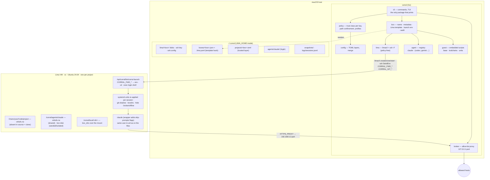
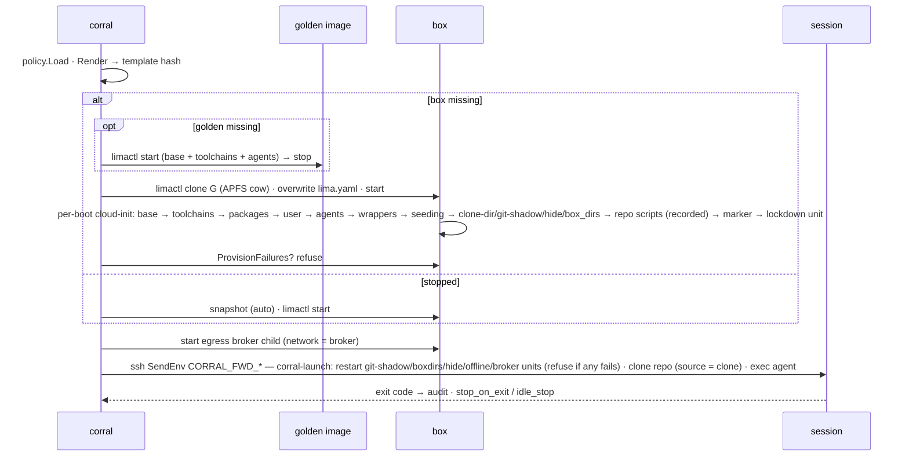

# Architecture

Corral is a Go CLI that turns a project directory into a Lima VM with an AI coding agent
inside, and keeps everything that decides *what the box may reach* on the Mac side of the
boundary.

**Trust boundary.** Everything above the VM line decides; everything inside enforces what it was
told and can be inspected (`corral egress`, `doctor <box>`, `audit`). A repository's own
`.corral.toml` passes through `policy` first: it may add toolchains, packages, `hide`, `box_dirs`,
tighten `network`/`agent_state`/`profile`, but never mount, forward or name a secret — those keys are
refused in that file.

## Packages

| Package | Responsibility |
|---|---|
| `cmd/corral` | `main`; imports agent packages for registration. |
| `internal/cli` | Cobra commands, launch flow, dashboard glue, doctor, setup. Only package that prints. |
| `internal/config` | TOML schema, merge (flags > project > global > defaults), shape validation. |
| `internal/policy` | **What configuration we will act on.** Trust class per key (a repository's `.corral.toml` can shape the guest but never widen host access), path confinement for `provision` / `hide` / `box_dirs`, refused project paths and mounts, profiles as floors. `policy.Load` is how every command loads config. |
| `internal/box` | Project → box name, metadata, **template rendering**, launch environment, audit log. The only place that knows the shape of a Lima template. |
| `internal/lima` | Typed wrapper around `limactl` and per-instance `ssh -F`. No policy. |
| `internal/broker` | The egress allow-list proxy for `network = "broker"`: CONNECT/forward, no TLS termination, loopback only, deterministic per-box port. `box/broker.go` owns its lifecycle on the host (child process, PID in metadata). |
| `internal/agent` | `Agent` interface + registry. `internal/agent/claude` is the first implementation. |
| `internal/guest` | Embedded shell scripts that run inside the VM (base, toolchains, the systemd units for git-shadow / hide / box_dirs / offline / broker) and the generated wrappers: every provision script gets the `CORRAL_USER` header, repository scripts are wrapped so a failure is recorded. |
| `internal/ui` | lipgloss styles, progress runner, Bubble Tea dashboard. |
| `internal/paths` | Host directory layout; enforces the 104-byte socket-path limit. |

## Box lifecycle

1. `corral claude` resolves the project (`cwd` or `-C`), derives the default
   box name `<slug-of-dirname>-<6 hex of sha256(abs path)>`, and loads config
   through `policy.Load`: defaults ← global ← project (restricted) ←
   `~/.corral/projects/<name>.toml` (trusted) ← flags.
2. `box.Render()` builds the Lima template: vz + virtiofs, resources, mounts
   (project — omitted in `source = "clone"`, where the launcher clones the
   repository into that path at session start from per-session env
   `CORRAL_CLONE_URL/REF`, so the template never carries a branch —, agent
   state, extras), provisioning scripts (system base →
   toolchains → packages → user base → agents → wrappers/profile → state
   seeding → clone dir / git shadow / hide / `box_dirs` units → repository
   scripts, each wrapped so a non-zero exit is recorded → end-of-provisioning
   marker → offline/broker lockdown unit) and readiness probes. Every script
   is prefixed with the provision environment header (`CORRAL_USER`,
   `CORRAL_HOME`, `CORRAL_NETWORK`, `CORRAL_SOURCE`). Its sha256 is
   the **template hash**.
3. If the box does not exist it is built from a **golden image**: `render(golden)`
   produces the project-independent subset (base + toolchains + agents, no
   mounts), named `golden-<12 hex of its hash>`; if that instance is missing it
   is created with `limactl start` and then stopped. The box is `limactl clone`d
   from it (APFS copy-on-write, milliseconds), its `lima.yaml` is overwritten
   with the full project template, and `limactl start` boots it — Lima re-runs
   every provision script on each boot and ours are idempotent, so only the
   project delta costs time. `golden = false` / `--no-golden` uses plain
   `limactl start --name <box> <yaml>`. Progress lines stream into the TUI;
   metadata is saved with the hash and the golden's name.
4. If it exists but the hash differs, the user is warned (`corral rebuild`).
5. `BuildLaunch()` assembles the environment: aliases (`env_from_host`, fail
   closed) → `keychain_env` (macOS Keychain when not exported, fail closed) →
   explicit `env` → automatic passthrough (`forward_env` + the agent's own
   list) → terminal vars → git identity → git tokens → box identity vars.
   Only variable **names** go to the audit log. `doctor <box>` runs the
   same declarations as checks from inside the guest.
6. The session runs as `ssh -F ~/.corral/lima/<box>/ssh.config -t
   -o SendEnv=CORRAL_FWD_* -o SendEnv=CORRAL_GIT_* lima-<box> -- corral-launch <workdir>
   <argv>`; the guest sshd's `AcceptEnv` allow-list admits exactly those
   patterns and `corral-launch` strips the prefix, `cd`s, and `exec`s through a
   login shell so `/etc/profile.d/corral.sh` (PATH, `CLAUDE_CONFIG_DIR`)
   applies.
7. Before the agent runs, `corral-launch` restarts the guest units (git shadow,
   `box_dirs`, hide, offline/broker) and refuses the session if one cannot be
   applied — a silently missing control is what a hostile checkout hopes for.
8. On exit the code is recorded; `stop_on_exit` optionally halts the VM, and
   `idle_stop` frees the RAM later (the guest never returns memory to the
   host while running — the dashboard shows the host footprint).

## Adding an agent

Implement `agent.Agent` in `internal/agent/<name>/`, call `agent.Register` in
`init()`, and add the blank import in `cmd/corral/main.go`. That yields:
the `corral <name>` command, provisioning into every new box, a wrapper
in `/opt/corral/bin` that applies the agent's YOLO flags, a persistent
state mount at `/corral/agents/<name>`, and inclusion in `agents`, `doctor` and
the dashboard. Existing boxes need `corral rebuild` to receive a new agent
(the template hash changes, so they will show as drifted).

## Adding a VM driver / OS

`internal/lima` is the only package that shells out to a hypervisor tool and
`box.Render` is the only place that emits its template. A Linux port keeps
both (Lima supports qemu/vz-less hosts) and changes `internal/cli/insight.go`
host checks; a Windows port would target Lima's WSL2 driver. Apple `container`
would be a sibling of `internal/lima` behind a small `Driver` interface —
deliberately not introduced yet to avoid speculative abstraction.

## Why shell out to `limactl` rather than link Lima?

The CLI is Lima's stable contract and the one the Lima team tests. Linking
`pkg/…` would tie us to internal APIs that change between minor versions, and
we would inherit Lima's build complexity. Every operation we need is one
`limactl` invocation plus `ssh -F`.

## Egress broker — design note

**Problem.** Every sandbox today ends at the network card. The agent token,
forwarded secrets and the project all sit inside the boundary and can be sent
anywhere; `network = "offline"` is the only control and it is all-or-nothing,
enforced *inside* the guest. Early reviews ranked this the largest gap.
Goal: a per-box **allow-list of destinations decided on the Mac**, outside the
boundary, with denied destinations audited (names, never payloads), and a path
to keeping credentials out of the box altogether.

### What Lima gives us (measured 2026-08-27 on Lima 2.2, vz)

| Fact | Consequence |
|---|---|
| The vz driver's default network is Lima's user-mode network (gvisor-tap-vsock): guest `192.168.5.x/24`, default route and `host.lima.internal` = `192.168.5.2`, DNS via Lima's host resolver at `192.168.5.3`. | All guest traffic is NATed by the `lima` host agent process. There is **no Lima-level egress filter**, and on the Mac the traffic leaves as an ordinary process of the user — `pf` cannot tell one box (or the box from the browser) apart. |
| A service bound to the Mac's `127.0.0.1:PORT` is reachable from the guest at `192.168.5.2:PORT` (verified: HTTP 200 through the gateway). | A broker can listen on loopback only — nothing on the LAN sees it — and every box reaches it at a known address. |
| `networks: [{vzNAT: true}]` gives the VM its own vmnet interface (`192.168.64.x`, `bridge100`) without root. | Traffic then has a **per-VM source IP** that `pf` on the Mac *could* filter — the only way to enforce the funnel outside the guest. It costs root on the Mac (`pfctl`, an anchor, rules that survive reboot), a per-box IP that is only known after boot, and reachability from the LAN. See tier 2. |
| `nft` is in the guest; `offline.sh` already installs a systemd unit that applies a ruleset after provisioning and drops the blanket `sudo`; the launcher refuses a session if the unit is not active. | The in-guest **funnel** ("only the broker port on the gateway") is a one-rule change to what offline mode does today. |

### Options considered

1. **Explicit HTTP(S) proxy on the Mac + in-guest funnel** *(chosen, tier 1)*.
   `corral` runs a CONNECT/forward proxy per box on `127.0.0.1:<port>`;
   the guest gets `HTTP_PROXY`/`HTTPS_PROXY`/`NO_PROXY` (profile.d, apt, npm,
   pip, go, git-https, Claude Code all honour them) and an nftables ruleset
   that accepts only `192.168.5.2:<port>` (+ established), rejects everything
   else including DNS — the proxy resolves names, so the guest needs none and
   cannot exfiltrate through it. The proxy matches the **CONNECT host / HTTP
   Host** against the allow-list, never terminates TLS, and writes an audit
   event per denied destination. Sudo is removed as in offline mode.
   *Honest limit:* the allow-list decision is on the Mac, but the funnel is
   still the guest kernel — undoing it takes a kernel or guest-agent bug, not
   a shell command, the same standing as offline mode today.
2. **Transparent proxy** (nftables DNAT of 80/443 to the broker, SNI sniffing).
   No client configuration, but it needs SNI parsing, cannot carry non-HTTP
   protocols either, and hides from the user *that* a proxy is in play.
   Rejected for tier 1; explicit env is what every tool documents.
3. **vzNAT + `pf` on the Mac** *(tier 2, opt-in hardening)*. Moves the funnel
   outside the guest: `pf` passes only `<box ip> → 127.0.0.1:<port>` and blocks
   the rest. Needs `sudo` on the Mac once per box start and a stable IP (pin via
   DHCP reservation on the vmnet or read `limactl list --json` after boot).
   Worth it for the unattended queue; not the default because Corral has
   never needed root on the Mac and the failure modes (stale anchors after a
   crash) are ugly. Design keeps the same broker; only the funnel changes.
4. **Lima `propagateProxyEnv` / hostResolver tricks**. Convenience only; no
   enforcement. Not a control.
5. **Credential-holding broker** *(tier 3)*. The broker adds `Authorization`
   for `api.anthropic.com` itself so the agent token never enters the box.
   Requires terminating TLS for that one host with a box-trusted CA, and a
   per-request policy (which paths). Deferred until tier 1 is in the field;
   the proxy is designed so this is an added handler, not a rewrite.

### Tier 1 design

* **Config.** `network = "broker"` joins `full | offline` (project-may-tighten:
  `full → broker → offline`). `egress = ["api.anthropic.com", "*.npmjs.org",
  "git.example.com"]` is **trusted-only** (a repository must not widen
  egress; it may *ask* — a project `egress` is a violation whose message tells
  the user to copy the hosts into `~/.corral/projects/<box>.toml`). Each
  profile carries a default list: `strict` moves from `offline` to `broker`
  with the agent API hosts and the `git_tokens` hosts, once shipped.
* **Port.** Deterministic per box — `42000 + (hash(box) % 1000)`, recorded in
  metadata and rendered into the template as the funnel port, so the template
  hash is stable across restarts (a per-start random port would mark every
  box drifted). Collision → next free, persisted.
* **Process.** A per-box `corral broker` child, started by whatever starts
  the box (`launch`, `up`, `start`, `rebuild`), PID in the box metadata beside
  the session PIDs; the idle sweep, `stop`, `gc` and `delete` kill it; a
  session refuses to start if the port is not answering (fail closed, like the
  in-guest units). No daemon, no launchd — same posture as `idle_stop`.
  Per box rather than shared because the usernet NAT presents every guest as
  `127.0.0.1`: a shared listener could not tell boxes apart.
* **Proxy.** Go stdlib (`net/http` CONNECT hijack + forward), no TLS
  termination, allow-list match on exact host or `*.suffix`, port 443/80 only
  by default (`egress = ["host:port"]` to widen), 30 s idle, no caching.
  Loopback bind only. Denied → `403` to the client and an audit event
  `egress-denied {box, host}`; allowed connects are counted, not logged.
* **Guest.** `broker.sh` (from `offline.sh`): ruleset accepts `lo`,
  established, `ip daddr 192.168.5.2 tcp dport <port>`; rejects all else
  (DNS included). `/etc/profile.d/corral.sh` and `/etc/environment` set
  `HTTP_PROXY=HTTPS_PROXY=http://192.168.5.2:<port>`, `NO_PROXY=localhost,
  127.0.0.1,192.168.5.0/24`; apt gets `Acquire::http::Proxy`. Sudo removed,
  scoped `systemctl restart corral-broker` kept. Provisioning still runs
  online first (installs), the lockdown follows the provisioning marker.
* **UX.** Create summary and `info` show `network broker · N hosts`; the MOTD
  says so; `corral audit` shows denials; `corral egress <box>` lists the
  live allow-list and recent denials so a blocked install is diagnosable in
  one command. Error text in the guest is curl/npm's own `403` — the MOTD
  points at the command.
* **Not covered (say so in SECURITY.md).** SSH-based git (use `git_tokens`
  over https), UDP/QUIC, anything that ignores proxy env (it simply fails —
  that is the control working). LAN and the Mac's other loopback ports are
  blocked, which `offline` today does *not* do.

### Status

Tier 1 shipped (see `changelog/`): `network = "broker"`, `egress`, `internal/broker`, `scripts/broker.sh`,
the per-box child process, `corral egress`. `--broker` flag, tier 2 (vzNAT + pf) and tier 3
(credential-holding broker) are not built. Verified on a Mac: allowed host 200-class through the
proxy, denied host 403 + `egress-denied` audit line, direct connect and DNS rejected by nft, sudo gone.

### Done when (tier 1, as planned)

`network = "broker"` + `egress` + `--broker`, `broker.sh`, the per-box process
and its lifecycle hooks, audit events, `egress` command, README, SECURITY.md
(boundary table row, known-paths row updated), CHANGELOG, tests: policy
(trust classes, profile floor `full → broker → offline`), proxy allow-list
matcher, port derivation; e2e on a Mac: allowed host 200, denied host 403 +
audit line, direct connect rejected by nft.
